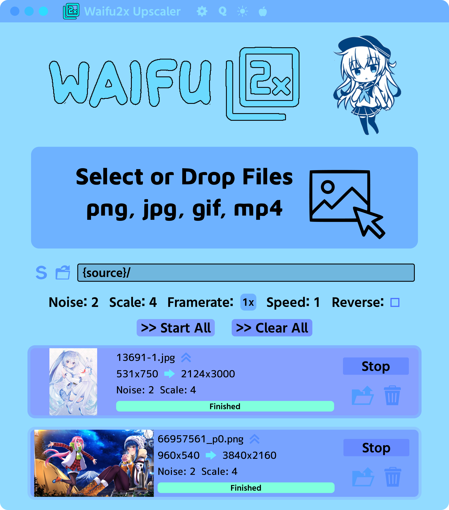

## Waifu2x Upscaler



A cute image upscaler!

### Features:
- Upscale images (JPG, PNG, WEBP, AVIF)
- Upscale animated images (GIF, APNG, Animated WEBP)
- Upscale videos (MP4, WEBM)
- Upscale PDFs (PDF)
- Apply effects such as speed or reverse
- Video framerate interpolation
- Customize settings (noise, scale, mode, framerate, etc.)
- Upscale multiple images (or multiple frames of a gif/video) concurrently
- Change the upscaler (Waifu2x, Real-ESRGAN, Real-CUGAN, Anime4K, or custom)

Warning: Upscaling too many images in parallel can cause your computer to freeze if it runs out of CPU/RAM.

### Waifu2x

Waifu2x only supports scale factors in multiples of 2 from 1/2/4 and noise level -1/0/1/2/3 (set to -1 for no denoise).

### Real-ESRGAN

Real-ESRGAN only supports scale factors between 2-4, and all other options are ignored. By setting the scale factor to 4x, it will use the slower Anime4x model that gives better results.

### Real-CUGAN

Real-CUGAN only supports scale factors 1/2/3/4, and noise level -1/0/1/2/3 and only noise 0 and 3 for scale factors 3/4.

### Custom Models

You can add custom PyTorch models to the "models" folder in the location the app is installed. You need to install python in order to run them. If you have trouble, try installing the dependencies:

```
pip3 install torch torchvision opencv-python Pillow numpy spandrel --compile --force-reinstall
```

### Design

Our design is available here: https://www.figma.com/design/KXFlnNiiqjK18WgVIqxaVu/Waifu2x-Upscaler

### Installation

Download from [releases](https://github.com/Moebytes/Waifu2x-Upscaler/releases).

### MacOS

On MacOS unsigned applications won't open, run this to remove the quarantine flag.
```
xattr -d com.apple.quarantine "/Applications/Waifu2x Upscaler.app"
```

### Related/Credits

- [my waifu2x module](https://github.com/Moebytes/waifu2x)
- [waifu2x](https://github.com/nagadomi/waifu2x)
- [real-esrgan](https://github.com/xinntao/Real-ESRGAN)
- [real-cugan](https://github.com/bilibili/ailab)